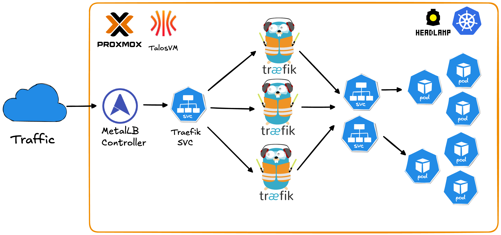
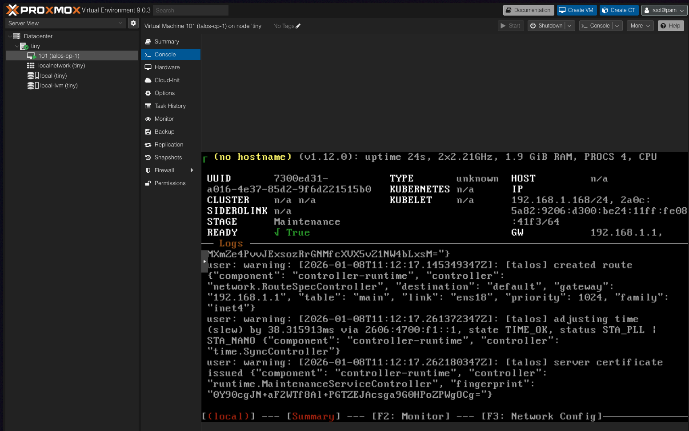
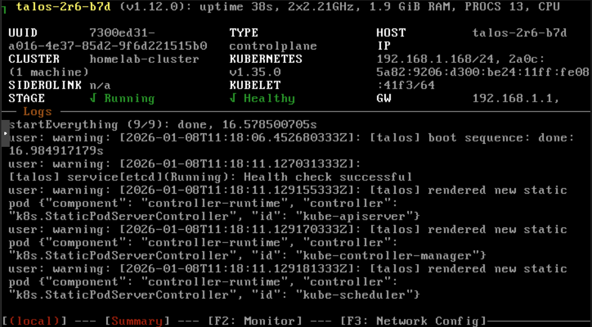
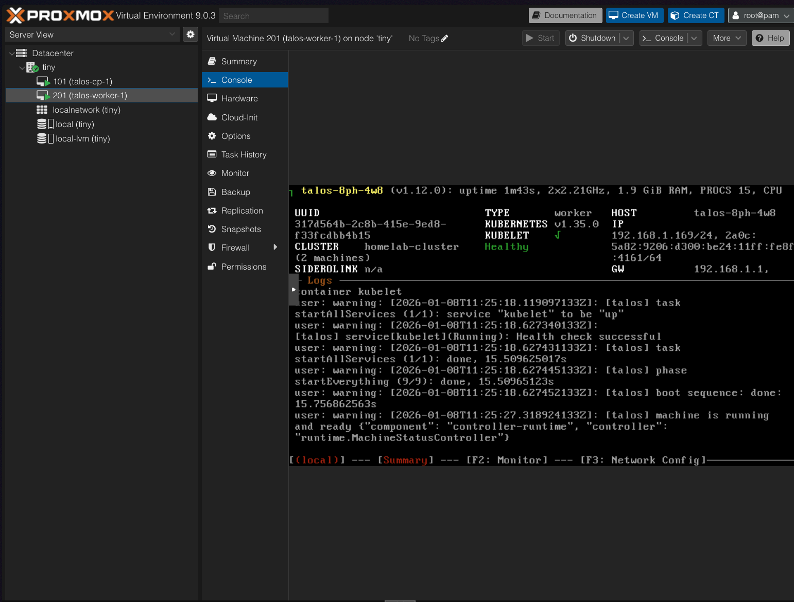
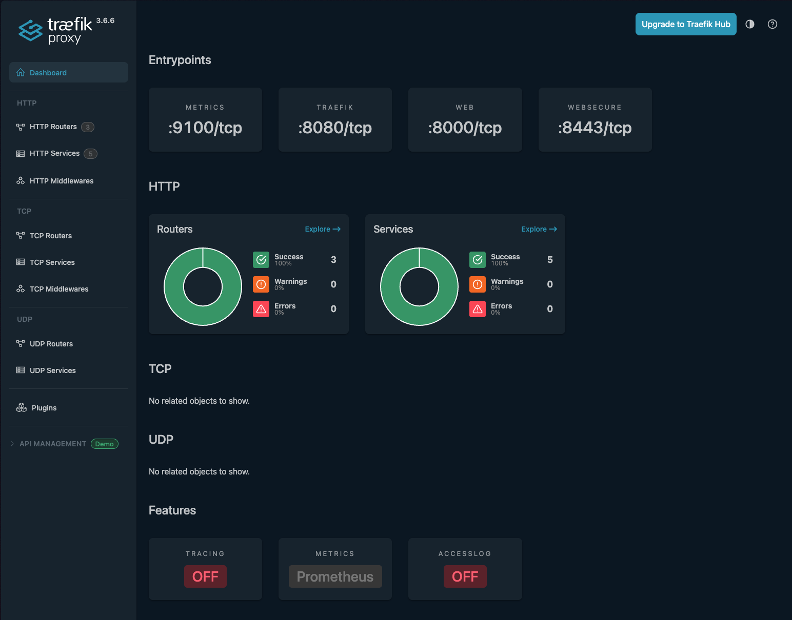
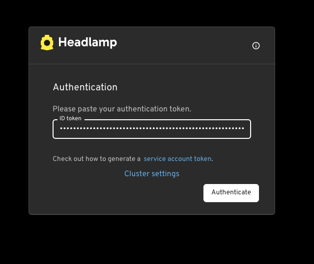
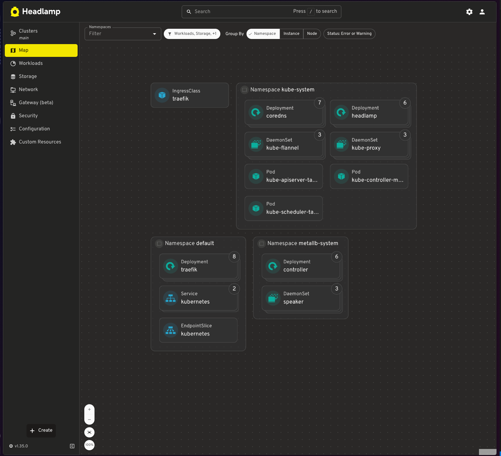

# Talos Kubernetes on Proxmox with Traefik

## Why This Matters

Running Kubernetes at home has traditionally meant dealing with the overhead of full Linux distributions, manual cluster setup, and the complexity of production-grade networking. This repository solves those pain points by leveraging **Talos Linux** a minimal, immutable, API-driven OS built specifically for Kubernetes - combined with **Traefik** for seamless ingress routing.

**Problems this solves:**
- **No OS maintenance overhead** - Talos is immutable and managed entirely via API
- **Fully reproducible** - Destroy and rebuild your entire cluster in minutes with simple scripts
- **Production-grade networking** - MetalLB LoadBalancer + Traefik ingress
- **Automated workflows** - Scripts handle VM creation, node provisioning, and cluster joining automatically
- **Zero cloud costs** - Learn production Kubernetes patterns on your own hardware without monthly bills
- **Secure by default** - Minimal attack surface with no SSH, shell access, or unnecessary packages
- **Built-in observability** - Traefik dashboard and Headlamp UI for cluster management out of the box

---

Production-ready Kubernetes cluster using Talos Linux on Proxmox VE with Traefik ingress controller.

## Features

- **Immutable OS**: Talos Linux provides API-driven infrastructure
- **High Availability**: Multi-node setup with MetalLB load balancing
- **Ingress**: Traefik with high availability load balancing
- **Web UI**: Headlamp dashboard for cluster management
- **Automated**: Scripts for quick worker node deployment



## Prerequisites

- Proxmox VE running
- Talos ISO downloaded to Proxmox (default path: `/var/lib/vz/template/iso/metal-amd64.iso`)
- Available IP addresses for nodes in your network
- kubectl installed on your workstation
- Helm 3 installed on your workstation

## 1. Install talosctl

```bash
curl -sL https://github.com/siderolabs/talos/releases/latest/download/talosctl-$(uname -s | tr '[:upper:]' '[:lower:]')-$(uname -m | sed 's/x86_64/amd64/;s/aarch64/arm64/') -o ~/bin/talosctl
chmod +x ~/bin/talosctl
export PATH="$HOME/bin:$PATH"
```

## 2. Create Control Plane VM

Create VM in Proxmox UI or via CLI:

```bash
# On Proxmox server
# Adjust storage (local-lvm), bridge (vmbr0), and ISO storage (local) to match your setup
qm create 101 \
  --name talos-cp-1 \
  --memory 2048 \
  --cores 2 \
  --cpu x86-64-v2-AES \
  --sockets 1 \
  --numa 0 \
  --net0 virtio,bridge=vmbr0,firewall=1 \
  --scsihw virtio-scsi-single \
  --scsi0 local-lvm:32,iothread=1 \
  --ide2 local:iso/metal-amd64.iso,media=cdrom \
  --boot order=scsi0\;ide2\;net0 \
  --ostype l26

qm start 101
```

Note the VM's IP address from console.



## 3. Bootstrap Cluster

```bash
# Generate configs
talosctl gen config homelab-cluster https://<control-plane-ip>:6443

# Configure talosctl
export TALOSCONFIG=$(pwd)/talosconfig
talosctl config endpoint <control-plane-ip>
talosctl config node <control-plane-ip>

# Apply config
talosctl apply-config --insecure --nodes <control-plane-ip> --file controlplane.yaml

# Wait 60 seconds, then bootstrap
talosctl bootstrap

# Get kubeconfig
talosctl kubeconfig .
export KUBECONFIG=$(pwd)/kubeconfig

# Wait for control plane to be Ready (~60 seconds)
kubectl get nodes
# Node will show "NotReady" initially, wait until it shows "Ready"

# Keep these environment variables set for all following steps
echo "TALOSCONFIG: $TALOSCONFIG"
echo "KUBECONFIG: $KUBECONFIG"
```



## 4. Add Worker Nodes

**Note:** Ensure `TALOSCONFIG` environment variable is still set from Step 3.

### Option A: Automated (Recommended)

```bash
# Setup SSH to Proxmox
scripts/setup-proxmox-ssh.sh <proxmox-ip>

# Add worker (replace <proxmox-node> with your Proxmox node name, usually 'pve')
scripts/add-talos-worker.sh -n talos-worker-1 -i <worker-ip> -p <proxmox-node> -v 201
```

### Option B: Manual

```bash
# Create VM in Proxmox, then:
scripts/add-worker-manual.sh
# Enter worker IP when prompted
```



## 5. Install MetalLB

```bash
kubectl apply -f https://raw.githubusercontent.com/metallb/metallb/v0.14.5/config/manifests/metallb-native.yaml
kubectl wait --namespace metallb-system --for=condition=ready pod --selector=app=metallb --timeout=90s

# Update the IP range below to match your network
kubectl apply -f - <<EOF
apiVersion: metallb.io/v1beta1
kind: IPAddressPool
metadata:
  name: default-pool
  namespace: metallb-system
spec:
  addresses:
  - 192.168.1.200-192.168.1.250  # Change to your available IP range
---
apiVersion: metallb.io/v1beta1
kind: L2Advertisement
metadata:
  name: default
  namespace: metallb-system
spec:
  ipAddressPools:
  - default-pool
EOF
```

## 6. Install Traefik

```bash
helm repo add traefik https://traefik.github.io/charts
helm repo update

helm install traefik traefik/traefik --wait \
  --set ingressRoute.dashboard.enabled=true \
  --set ingressRoute.dashboard.matchRule='Host(`dashboard.localhost`)' \
  --set ingressRoute.dashboard.entryPoints={web} \
  --set providers.kubernetesGateway.enabled=true \
  --set gateway.listeners.web.namespacePolicy.from=All

kubectl apply -f - <<EOF
apiVersion: traefik.io/v1alpha1
kind: IngressRoute
metadata:
  name: traefik-dashboard
  namespace: default
spec:
  entryPoints:
  - web
  routes:
  - kind: Rule
    match: PathPrefix(\`/dashboard\`) || PathPrefix(\`/api\`)
    services:
    - kind: TraefikService
      name: api@internal
EOF

kubectl scale deployment traefik -n default --replicas=3  # Adjust replica count as needed
kubectl wait --namespace default --for=condition=ready pod -l app.kubernetes.io/name=traefik --timeout=60s

# Access at http://<external-ip>/dashboard/
kubectl get svc traefik


```


## 7. Install Headlamp (Kubernetes UI)

```bash
helm repo add headlamp https://kubernetes-sigs.github.io/headlamp/
helm repo update

helm install headlamp headlamp/headlamp \
  --namespace kube-system \
  --create-namespace \
  --set config.baseURL=/headlamp \
  --wait

kubectl apply -f - <<EOF
apiVersion: traefik.io/v1alpha1
kind: IngressRoute
metadata:
  name: headlamp
  namespace: kube-system
spec:
  entryPoints:
  - websecure
  routes:
  - kind: Rule
    match: PathPrefix(\`/headlamp\`)
    services:
    - name: headlamp
      port: 80
  tls: {}
EOF

kubectl create token headlamp -n kube-system --duration=87600h > headlamp-token.txt
cat headlamp-token.txt

# Access at https://<external-ip>/headlamp/
# Login with token from headlamp-token.txt
```




## Quick Reference

### Access Points

- Traefik Dashboard: `http://<external-ip>/dashboard/`
- Headlamp: `https://<external-ip>/headlamp/`

### Useful Commands

```bash
# Cluster status
kubectl get nodes
kubectl get pods -A

# Talos health
talosctl health
talosctl dashboard

# Scale workers
scripts/add-talos-worker.sh -n talos-worker-2 -i <ip> -p <proxmox-node> -v 202
```
